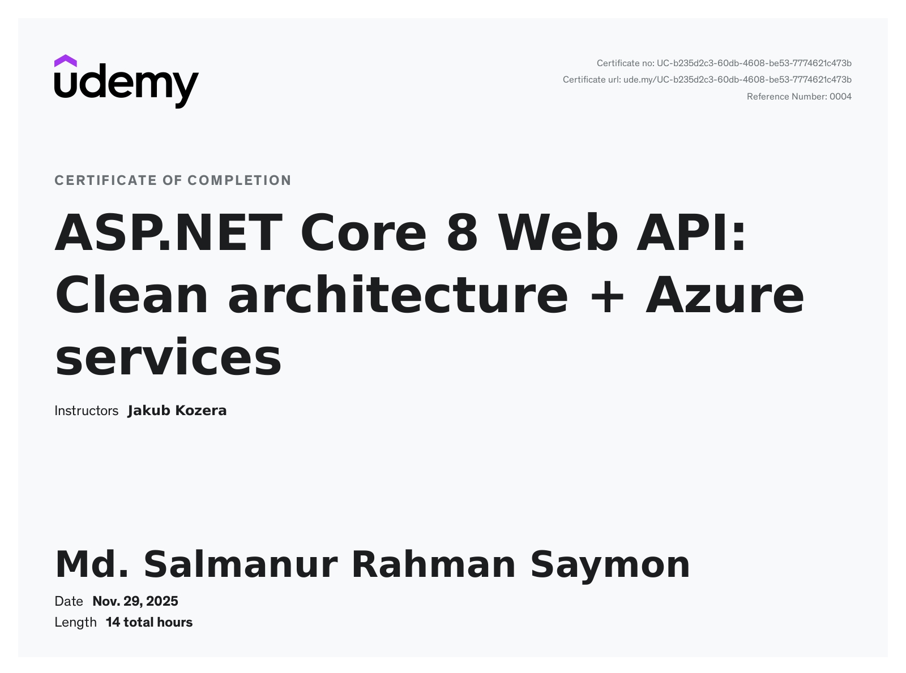

# ASP.NET Core 8 Web API: Clean Architecture + Azure Services

**Udemy Certificate of Completion**

- **Student:** Md. Salmanur Rahman Saymon  
- **Date:** November 29, 2025  
- **Instructor:** Jakub Kozera  
- **Certificate Number:** UC-b235d2c3-60db-4608-be53-7774621c473b  

---

## What I Learned & Key Skills Gained

- Completed intensive hands-on training in building **production-grade RESTful Web APIs** using ASP.NET Core 8.
- Mastered **Clean Architecture** principles, CQRS pattern, and MediatR for highly maintainable and scalable applications.
- Gained practical experience with **Entity Framework Core**, Repository Pattern, and advanced database operations.
- Integrated **Azure cloud services** (App Services, Azure SQL Database, Storage Accounts) for real-world deployment and scaling.
- Implemented secure authentication (**JWT**), API versioning, global exception handling, and automated **CI/CD pipelines**.

---

**Full certificate image above**  
You can also download the original PDF from the file `Saymon_Professional_Competence_Udemy_ASP_Dot_NET_Core.pdf`
